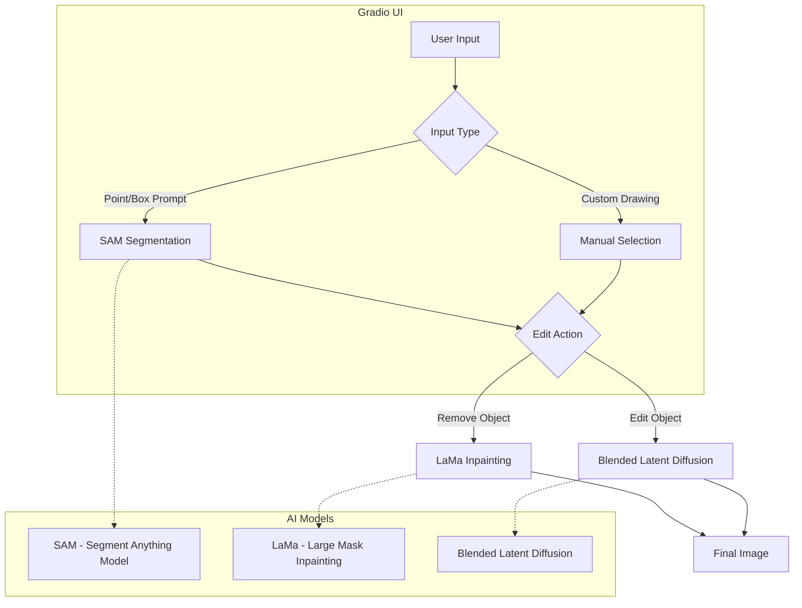

# AI-Powered Photo Editor

[](https://huggingface.co/spaces/aakashks/adv-photo-editing)

## Overview

The AI-Powered Photo Editor is an advanced image editing tool that integrates state-of-the-art AI models to provide users with powerful editing capabilities. This tool is built using a Gradio interface, making it user-friendly while leveraging cutting-edge techniques like SAM, LaMa, and blended latent diffusion for various image manipulation tasks.

### Key Features

- **Object Selection**: Utilize the SAM (Segment Anything Model) for precise object selection using point or box prompts.
- **Object Removal**: Seamlessly remove objects and fill backgrounds using LaMa inpainting.
- **Text-Guided Editing**: Transform selected objects based on text prompts with blended latent diffusion.
- **Custom Area Editing**: Draw and select specific areas for targeted modifications.

### Integrated AI Models

1. **SAM (Segment Anything Model)**: Ensures accurate object segmentation and selection.
2. **LaMa (Large Mask Inpainting)**: Provides high-quality inpainting after object removal.
3. **Blended Latent Diffusion**: Facilitates text-guided object transformation and editing.

### Additional Utilities

- **Background Removal**
- **Sticker Creation**

These features make the toolkit versatile for various image manipulation tasks, offering both basic and advanced functionalities.

## Diagram



## Installation & Usage

### Prerequisites

Ensure you have Python (>=3.9) and the necessary dependencies installed.

### Clone the Repository

```bash
git clone https://github.com/dsgiitr/segmedit.git
```

### Install Dependencies

Navigate to the project directory and install the required Python packages:

```bash
pip install -r requirements.txt
```

### Running the Application

Execute the following command to start the application:

```bash
python app.py
```

This will launch the Gradio interface, where you can interact with the AI-powered photo editor.
