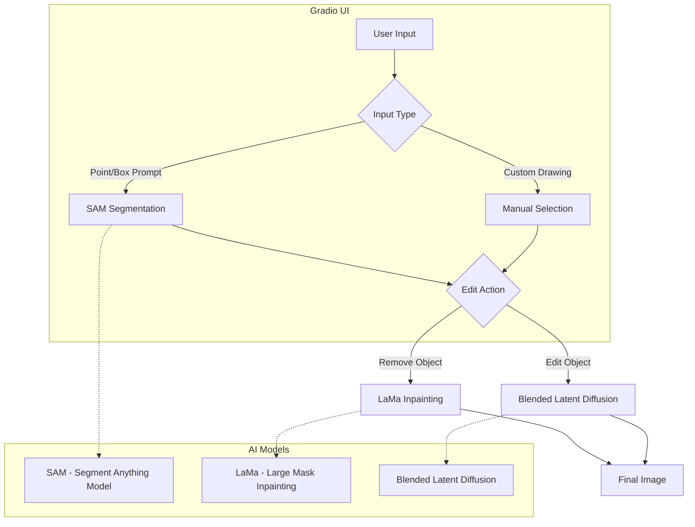

# AI-Powered Photo Editor

Implementation of SAM, LaMa, and blended latent diffusion models for advanced image editing using Gradio UI.

## Diagram



## Project Description

This project offers a comprehensive photo editing tool with the following key features:

- **Object Selection**: Utilizes SAM (Segment Anything Model) for precise object selection using point or box prompts.
- **Object Removal**: Implements LaMa inpainting for seamless object removal and background filling.
- **Text-Guided Editing**: Employs blended latent diffusion for transforming selected objects based on text prompts.
- **Custom Area Editing**: Allows users to draw and select specific areas for targeted modifications.

The user interface is built using Gradio, providing an intuitive platform for users to interact with these advanced AI models. The project integrates multiple state-of-the-art techniques:

1. **SAM**: For accurate object segmentation and selection.
2. **LaMa**: For high-quality inpainting after object removal.
3. **Blended Latent Diffusion**: For text-guided object transformation and editing.

Additional utilities include background removal and sticker creation, enhancing the toolkit's versatility for various image manipulation tasks.

## Setup
- Clone 
```
git clone https://github.com/dsgiitr/segmedit.git
```
- Install dependencies
```
pip install -r requirements.txt
```
- Run app.py
``` 
python app.py
```
